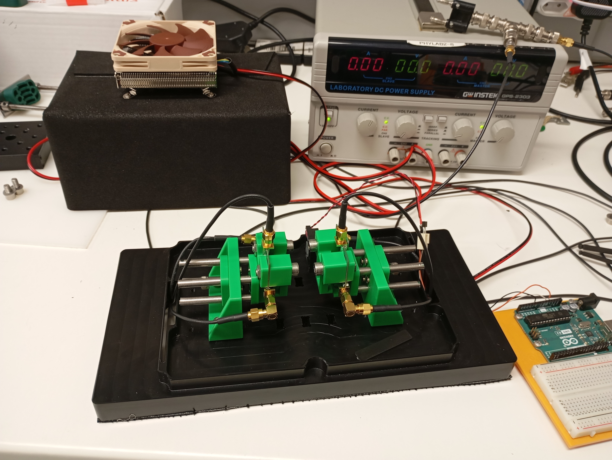

# Optical Properties
## Transmission and Absorbance Spectroscopy
To measure how much light can pass through a pixel as a function of wavelength. [Transmittance](Nomenclature#transmittance) should be maximal at the wavelength of peak detector efficiency. [Absorbance](Nomenclature#absorbance) should be minimal at this same wavelength.
## Photoluminescence Spectroscopy
To measure the peak excitation and emission wavelength, from which the [Stokes shift](Nomenclature#stokes-shift) can be determined. The Stokes shift should be maximized to limit [self-absorption](Nomenclature#self-absorption). 
## Energy Spectrum
Typically a histogram of scintillation pulse integrals over some time window. 
## Energy Resolution
## Coincidence Time Resolution
# Chemical Properties
## Particle Size Distribution
%% To do %%
## Thermogravimetric Analysis
%% To do %%
# Apparatus at UCT
## CTR Bench in the PET Lab

## Components
- MICROFJ-SMA-30035-GEVB
- MICROFC-SMA-60035-GEVB
- MICROFC-SMTPA-30050-GEVB