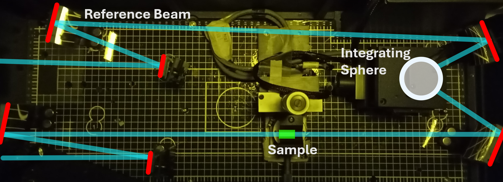
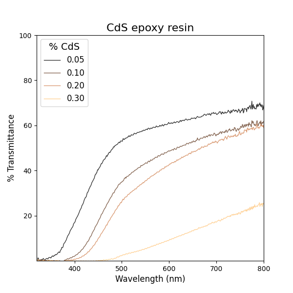
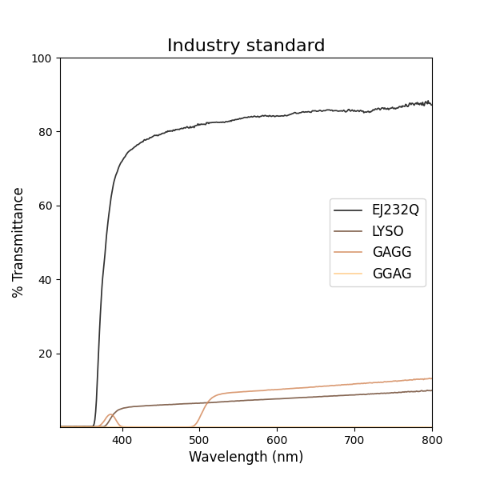
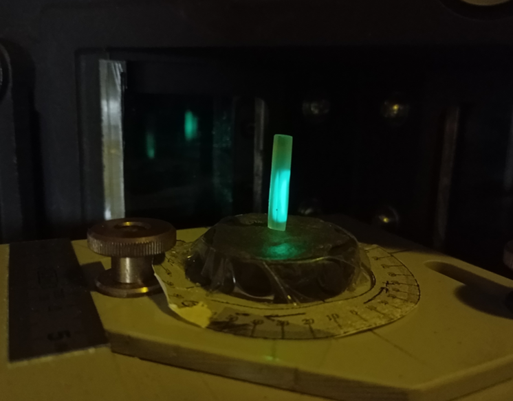
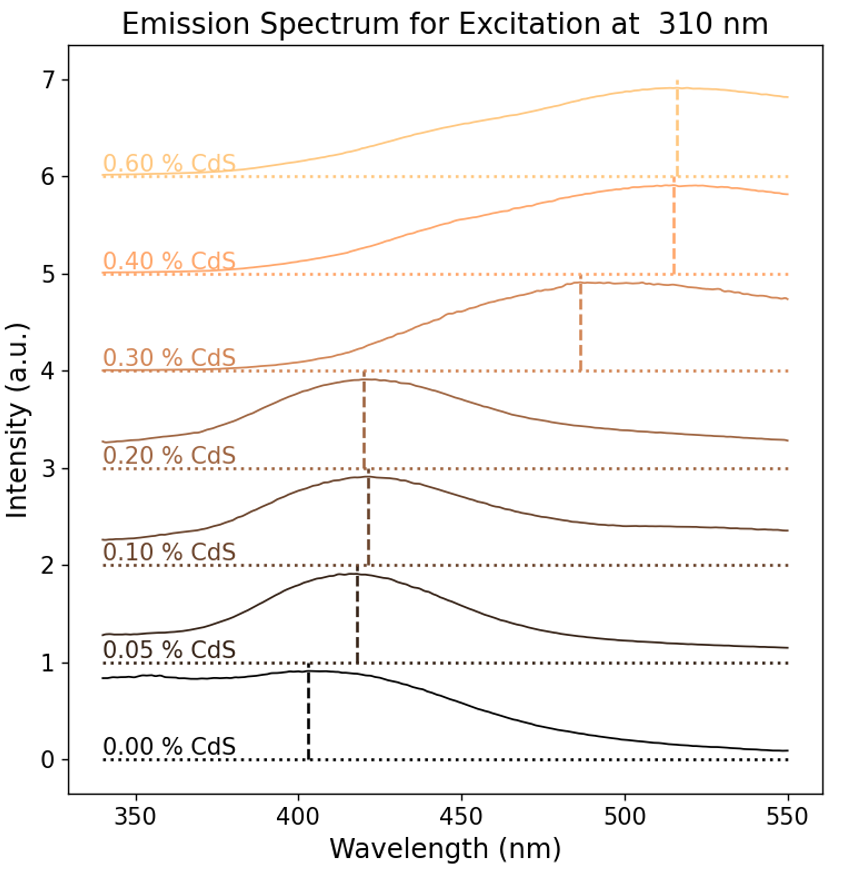
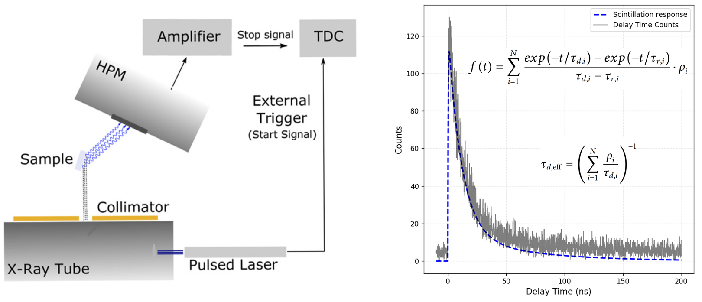

# Description
- Pixels from [Trial 1](EPOXY_CdSRT_28022025.md) were in general of better quality than those of [Trial 2](EPOXY_CdSRT_03032025.md) - the former were more rigid, while the latter were simply too malleable to polish properly (see the two right-most pixels in the figure below). 
- In both cases, QD agglomeration and bubble formation could be clearly seen. 
- Samples with more toluene shrunk more due to toluene evaporating. This means they required more polishing to achieve a flat, smooth surface finish, ultimately removing more material and resulting in pixels of smaller total volume. Compare the 0.05 wt.% pixel with the 0.3 wt.% pixel in the figure below. 

 

*Epoxy CdS RT samples under UV illumination*
# Characterization
## Transmittance
Transmittance measurements were made for all samples at the Crystal Clear lab in CERN. The bench directed a variable wavelength light source through samples and into an integrating sphere. A reference beam travelling the same distance through air was used to measure the relative intensity of light passing through the sample.

*Transmittance bench setup at the Crystal Clear lab at CERN*

CdS composite samples were compared with industry standard LYSO, EJ232Q, GAGG (crystal) and GGAG (ceramic) samples. A clear drop in transmittance can be seen with increasing CdS wt.%.

Compare this with the transmittance of the industry standard samples. The "gold standard" is the plastic EJ232Q, while the ceramic GGAG has effectively zero transmittance.

*Results of transmission measurements for CdS composite pixels (top) compared to industry standard pixels (bottom).*
## Photoluminescence Spectroscopy
PL measurements were also taken at the Crystal Clear lab at CERN. Pixels were orientated such that the excitation light was incident normal to one face, with the adjacent face normal to the detector (see figure below). This was done to measure PL in transmission mode - essentially to mitigate any direct reflections into the detector. 

*Photoluminescence spectroscopy setup at CERN*

Emission spectra have a distinct peak just above 400 nm that shifts to longer wavelengths with increasing QD wt.%. It is worth noting that the highest two wt.% samples were unpolished for this measurement. 

*Photoluminescence emission peaks for CdS RT samples under 310 nm excitation.*
## Time Correlated Single Photon Counting
The methodology for this measurement is well described by [Pagano *et al.*](References#pagano2022a)

