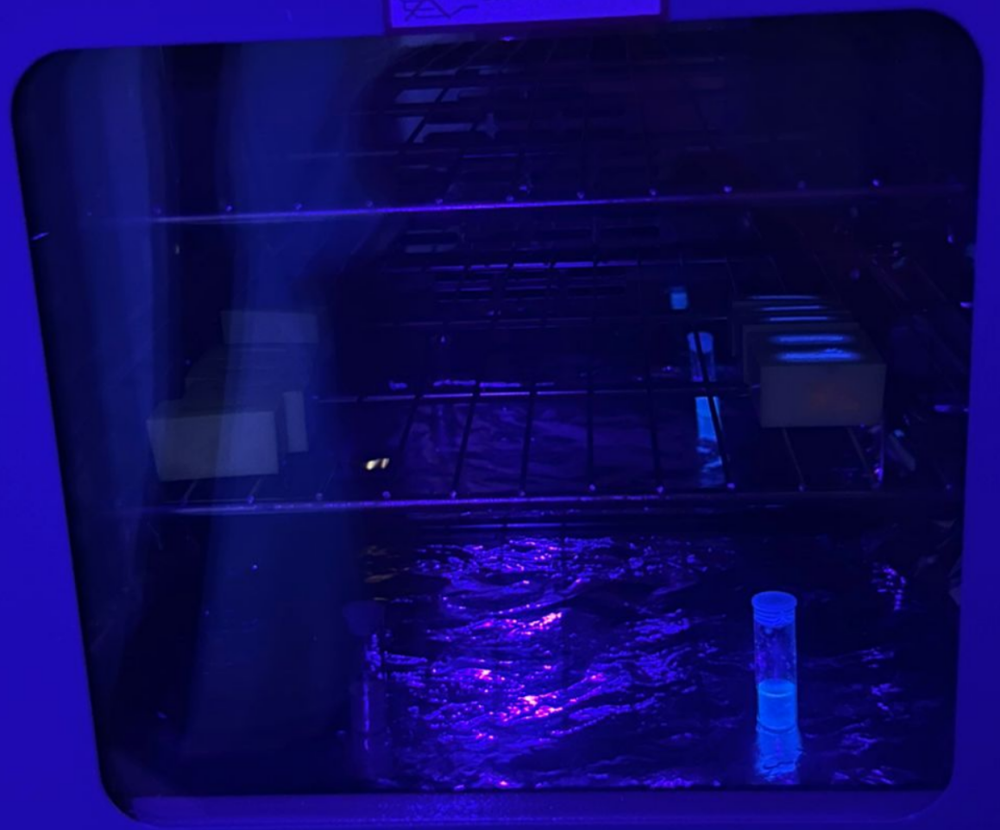
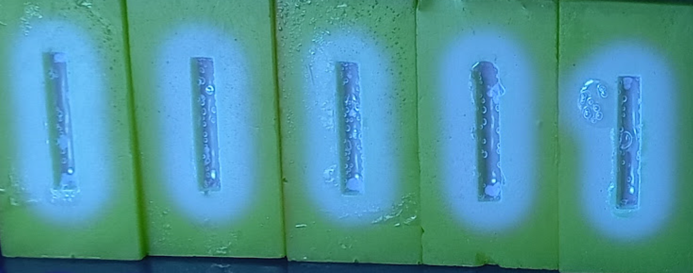
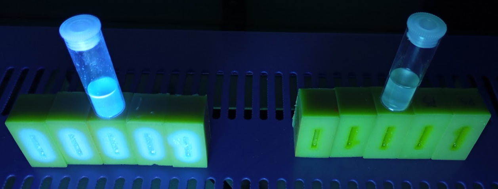

# Description
This was the first trial run for making polystyrene samples. No quantum dots were added. There was a simple control of just polystyrene (PS) to compare with the attempted scintillator material doped with PPO and POPOP
# Scintillator
## Constituents
- 5 ml *styrene*
- 24.160 mg 75% wt. *BPO*, 25% wt. $H_2O$ 
- 131.389 mg *PPO*
- 18.215 mg *POPOP* 
## Fabrication process
Based on the methodology from [this paper](https://onlinelibrary.wiley.com/doi/abs/10.1002/admt.202302075) by Orfano *et al.*, 2024.
>[!quote] Preparation of Polystyrene (PS) -Based Nanocomposites:
> Styrene monomer was purchased from Sigma-Aldrich (CAS no. 100-42-5) in the form of a liquid and colorless monomer. After the removal of the stabilizer, the 1,4-Bis (5-phenyl-2-oxazolyl) benzene (POPOP, Sigma Aldrich, CAS no. 1806-34-4, MW = 364.40 g mol−1) dye was dissolved with the addition of the as-prepared hafnium oxide nanoparticles. Then, the monomer polymerization followed a thermal pathway by using Azobisisobutyronitrile (AIBN), a free radical initiator, and the VAZO 64 (Chemours). The final composition was obtained as follows: 3.64 mg of POPOP and 1 mg of VAZO 64 were dissolved in 1 mL of styrene through ultrasonic stirring. Then 25 ± 1 mg of hafnium oxide nanoparticles were added to the solution and then dispersed through stirring. 
> >[!tip] We exchanged HfO2 with equivalent distribution of PPO molecules.
> 
> The as-prepared solution was placed in a temperature-controlled oil bath at 80 °C for 1 day. For the first 8 h, the mixture was mechanically stirred every hour to avoid nanoparticle sedimentation. At the end of the process, a PS-based plastic scintillator was obtained with a 10−2 m dye concentration and 2.5 + 0.1% wt hafnium oxide nanoparticles loading.

**11h30** -  Weighed required amount of all powder constituents into round-bottom flask. 
**12h15** - Added styrene. 
**12h30 - Submerged flask in oil bath in fume hood with water condenser "attached".
12h45 - Switched on hot plate (set to 80°C) and began stirring at 500 rpm.

>[!warning] 13h00 - Magnetic stirrer lost coherence due to contact with the flask.
>The condenser tube was too big, positioning the flask too deep in the oil bath.

>[!warning] 13h05 - Transferred solution into a smaller 2-neck round bottom flask

**13h30** - Magnetic stirrer behaved well now so started heating and stirring again 
**14h10** - Removed flask from oil bath and pipetted solution into silicone molds
14h12 - Molds placed in oven at 80°C

> [!warning] Solution was *very* fluid

**14h15** - Remainder of solution (the majority) placed back in oil bath and stirred for a further 20 min
**14h35** - Solution removed from oil bath, poured into glass centrifuge tube and placed in oven

>[!tip] Solution was more viscous

*Samples were left to cure overnight and were removed at 15h00 the following day*
# Control
## Constituents
- 5 ml *styrene*
- 24.200 mg 75% wt. *BPO*, 25% wt. $H_2O$  
## Fabrication Process
**13h35** -  Weighed required amount of BPO into 2-neck round-bottom flask. 
**13h37** - Added styrene. 
**13h40 - Submerged flask in oil bath in fume hood with water condenser.

>[!warning] Magnetic stirrer not moving
>Removed flask, started stirrer, then returned flask. Stirring kept below 300 rpm for stability.

>[!warning] No thermocouple for this hot plate
>External thermometer used, slow ramp of temperature

**14h30** - Magnetic stirrer behaved well now so started heating and stirring again. 
**14h40** - Removed flask from oil bath and pipetted solution into silicone molds
**14h45** - Remainder of solution (the majority) placed glass centrifuge tube 

> [!warning] Solution was fairly fluid

14h50 - Both placed in oven at 80°C

*Samples were left to cure overnight and were removed at 15h00 the following day*

# Results
## Silicon Molds
- Very little polystyrene remained in molds. Possibly evaporated? 
- Bubbles present in scintillator samples, not present in clean samples.

- Distinct overflow observed around mold boundaries.
	- Possible leaching into silicone?
	- Or simply evaporation of water?
## Glass tubes
- No visible bubbles
- Cloudy appearance - less so for the clean polystyrene
## UV illumination

*UV lamp illumination of cured scintillator (left) and control (right) samples*
