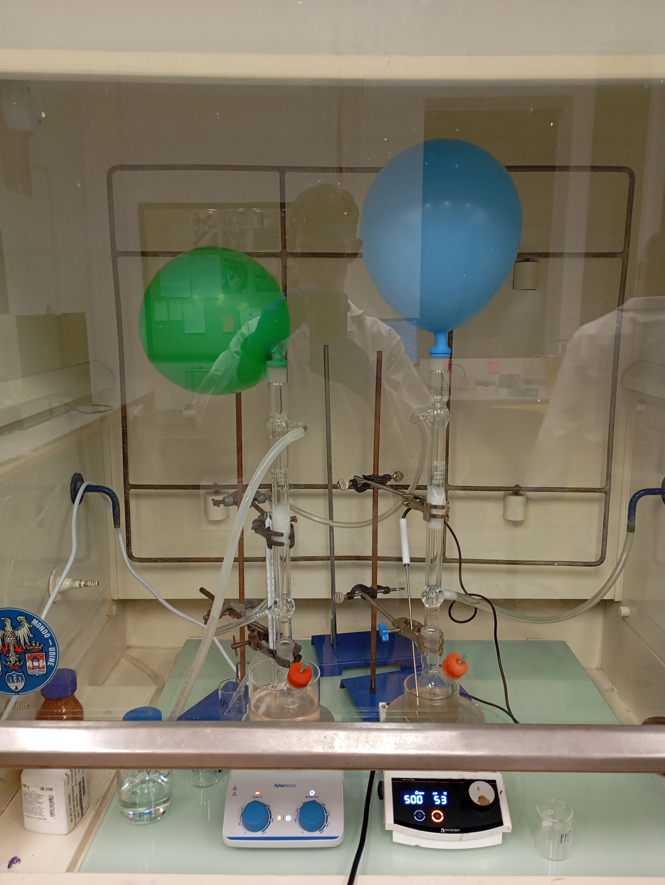

#logbook #fabrication
# Description
This is the second trial run for making polystyrene samples. Again, no quantum dots are added. The plan is to have another simple control of just polystyrene (PS) to compare with PS doped with PPO and POPOP, but taking into account the lessons learnt from [the first attempt](PS_PPO_POPOP_25032026.md). These were based on the following observations from the first attempt:
1. Very little polystyrene remained in the moulds after 24 hours in the oven, possibly due to evaporation.
2. Samples set in the centrifuge tubes were cloudy due to bubble formation during polymerization.
3. The styrene mixture was very fluid before being placed in the moulds. 
The current thinking is that this is primarily due to water (and/or other impurities?) remaining in the solution and then evaporating as the polymer set. The BPO, PPO and POPOP powders had quite a bit of moisture in them from the outset, and the BPO in particular is already 25% water. The following should be added to the methodology to refine the process:
4. The powders should be pre-dried
5. Any contained water should be boiled off the styrene mixture.
6. The solution should be degassed (or sonicated?) before being placed in moulds. 
7. The stoppered vials had smaller bubbles. Therefore, in this trial the silicone moulds are to be replaced with stoppered glass vials. 
Using glass vials would probably require breaking the final product out of the vials, but for now it is just a POC. In future, the use of PVA coating should be explored, as then the polystyrene could be removed by dissolving the PVA with warm water. The potential benefit of this is that the surface finish may be inherently smooth using this method ([Abe *et al*. 2026](References#abd2026pva)). 

To address these issues, the following changes are made from the first attempt:
1. **All powders are to be pre-dried** - *in the fume hood on a 40°C hot plate for 2 hrs.*
2. **Mixture is to be stirred under nitrogen** - *in fume hood with nitrogen filled balloons.*
3. **Mixing time at 80°C is to be increased to ~2 hrs** - *until solution becomes more viscous.*
4. **Replace silicone moulds with stoppered glass vials** - *to mitigate evaporation.*
5. **Samples are to be left in the oven at 80°C overnight** - *to keep a constant temperature.*
## Constituents
- 10 ml *styrene*
- 133.333 mg 75% wt. *BPO*, 25% wt. $H_2O$ 
- 100.000 mg *PPO*
- 10.000 mg *POPOP* 
>[!note] The control does not have PPO or POPOP
# Fabrication process
- Dry powders in on hot plate at 40°C for 2 hrs
>[!warning] BPO has a decomposition temperature of 70°C and is explosive when dry!
- Add to 10g (11.038 ml) of styrene
- Stir under nitrogen at 80°C for ~2 hrs - or until viscosity changes.
- Dispense 0.5ml, 0.75ml and 1ml into 1ml glass vials.
- Place in oven at 80°C overnight. 

# Timeline
12h50 - weighed 100 mg PPO, 133 mg BPO (x2) and 10 mg POPOP into beakers.
13h00 - dried these on hot plate at 40°C in fume hood for 2 hrs.
15h00 - added to 11 ml of styrene.
15h10 - mixture stirring at 500 rpm at 80°C in fume hood under nitrogen.
16h20 - mixture still not sufficiently viscous so continue stirring at 80°C.
16h50 - begin dispensing into vials and placing in oven at 80°C, starting with the control.
17h10 - finished dispensing scintillator into glass vials. All samples left in oven overnight.

# Results
Samples were initially crystal clear at 80°C. However, switching off the oven resulted in too rapid cooling, generating stresses in the polymer that manifest as cloudiness. In regions of extreme stress, a white band (that may be a crack) can be seen. To remedy this, half of the samples were annealed in a tube furnace set to ramp up to 100°C at a rate of 5°C per hr, hold that temperature for 2 hrs, then ramp back down at the same rate. 
>[!error] Furnace reached ~200°C in ~1 hr. Need to check PID control system.
>This also caused PS to melt and then boil, forming bubbles. 

